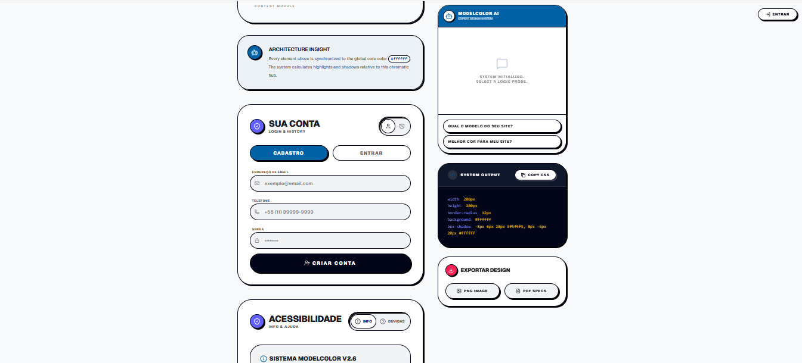

# 🎨 ModelColor v2.6 – Design Ops & Shadow Playground

## 📝 Descrição do Projeto
O **ModelColor** é um ecossistema de design experimental e funcional focado na exploração de cores, sombras e formas em tempo real. Projetado como uma ferramenta de **Design Ops**, o site permite que desenvolvedores e designers prototipem componentes visuais utilizando uma fusão de três estéticas modernas:
*   **Neubrutalismo:** Bordas sólidas e sombras agressivas.
*   **Neumorfismo:** Suavidade tátil e profundidade.
*   **Material Design 3:** Hierarquia funcional e acessibilidade.

Diferente de geradores simples, o ModelColor possui um ecossistema robusto que inclui autenticação de usuários, persistência em nuvem e exportação de especificações técnicas.

---

---

## 🛠️ Stack Tecnológica

### 💻 Core & Frontend
*   **TypeScript:** Tipagem estática e segurança de código.
*   **React 18:** Motor de renderização e gerenciamento de estados.
*   **Tailwind CSS (v4):** Estilização utilitária e design responsivo.
*   **Framer Motion:** Animações interativas e efeitos de transição.
*   **Lucide React:** Iconografia vetorial moderna.
*   **shadcn/ui:** Componentes de interface baseados em Radix UI.

### ☁️ Backend & Infraestrutura
*   **Firebase Authentication:** Login e cadastro seguro de usuários.
*   **Firebase Firestore:** Banco de dados NoSQL para salvar históricos de design.
*   **Google Cloud Platform:** Hospedagem de alta performance.

### 📄 Utilitários de Exportação
*   **html2canvas:** Captura do preview em formato PNG.
*   **jsPDF:** Geração automática de especificações técnicas em PDF.

---

## 🌟 Principais Funcionalidades

*   **Editor de Sombras em Tempo Real:** Controle total sobre distância, raio, tamanho e intensidade.
*   **Cloud Persistence:** Seus designs são salvos na conta e acessíveis de qualquer dispositivo.
*   **Exportação Multiformato:** Download imediato de specs em PDF e imagens PNG para times de design.
*   **Component Lab:** Galeria de exemplos práticos (botões, cards, switches) com o sistema aplicado.
*   **Foco em Acessibilidade:** Interface intuitiva com seção de onboarding integrada.

---

## 🔧 Como Executar
1. Clone o repositório.
2. Instale as dependências: `npm install`.
3. Inicie o servidor de desenvolvimento: `npm run dev`.

---
[⬅ Voltar ao Portfólio Principal](https://github.com/VictorAlvesRodriguesBraulino/VictorAlvesRodriguesBraulino)
